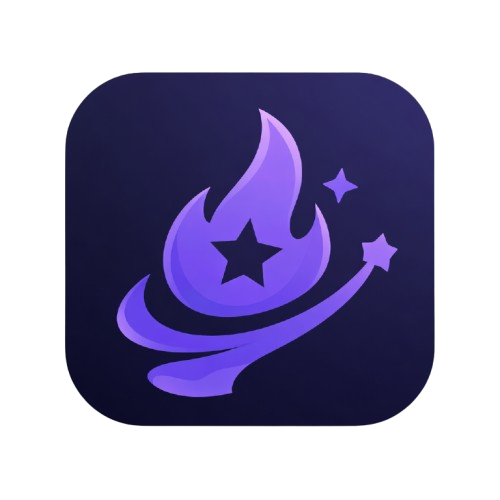

#  LifeQuest

> **Transform your professional growth into an epic RPG adventure.**

LifeQuest is a premium, developer-centric productivity platform that gamifies the software development lifecycle. Built for those who want to track their progress, crush their bugs, and level up their careers with the same intensity as an open-world RPG.

---

## ✨ Key Features

### 🛡️ Dashboard & Character Stats
- **RPG Identity**: Track your progress through four core developer attributes: **Vitality, Intelligence, Discipline, and Creativity**.
- **Dynamic Leveling**: Earn XP from completed tasks to level up your character and unlock new capabilities.
- **Analytics**: Beautifully rendered charts (via Recharts) to visualize your productivity trends.

### ⚔️ Quests & Boss Raids
- **Personal Quests**: Organize your daily work using a high-fidelity Kanban board.
- **Team Workspaces**: Collaborate with colleagues in specialized environments.
- **Boss Battles**: Large projects are transformed into "Boss Raids" where team members must coordinate to deplete the boss's HP through task completion.
- **Bug Monsters**: Encounter AI-generated "Bug Monsters" that represent technical debt or unexpected issues.

### 📜 Habits & AI Insights
- **Habit Tracking**: Maintain streaks for positive developer behaviors (like TDD or daily standups).
- **AI Companion**: Get personalized retrospectives and productivity advice powered by advanced AI models.
- **Weekly Retros**: Detailed analysis of your week's performance, burnout risk, and areas for improvement.

### 🎒 Inventory & Shop
- **Gold & Rewards**: Exchange your hard-earned quest gold for virtual items, profile decorations, or team perks.
- **Class System**: Specialize as a Frontend, Backend, DevOps, or Fullstack specialist.

---

## 🛠️ Tech Stack

- **Core**: [Next.js 16](https://nextjs.org/) (App Router), [React 19](https://react.dev/)
- **Backend / Auth**: [Supabase](https://supabase.com/) (PostgreSQL + OAuth)
- **Styling**: [Tailwind CSS 4](https://tailwindcss.com/), [Framer Motion](https://www.framer.com/motion/)
- **State Management**: [Zustand](https://zustand-demo.pmnd.rs/), [TanStack Query v5](https://tanstack.com/query/latest)
- **Visuals**: [Lucide React](https://lucide.dev/), [Recharts](https://recharts.org/)

---

## 🚀 Getting Started

### Prerequisites

- Node.js (Latest LTS)
- npm / pnpm / bun
- A Supabase project

### Installation

1. **Clone the repository**:
   ```bash
   git clone https://github.com/your-username/lifequest.git
   cd lifequest
   ```

2. **Install dependencies**:
   ```bash
   npm install
   ```

3. **Environment Setup**:
   Create a `.env.local` file in the root directory:
   ```env
   NEXT_PUBLIC_SUPABASE_URL=your_supabase_url
   NEXT_PUBLIC_SUPABASE_ANON_KEY=your_supabase_anon_key
   ```

4. **Run development server**:
   ```bash
   npm run dev
   ```

### Database Setup

The projects migrations are managed via Supabase. Visit the [Supabase Dashboard](https://supabase.com/dashboard) to set up your tables:
- `users`: Core profile and stats.
- `quests`: Task management.
- `habits`: Recurring tracking.
- `workspaces`: Team collaboration.

---

## 🎨 Design Philosophy

LifeQuest follows a **Premium Dark Aesthetic** designed specifically for developers.
- **Glassmorphism**: Subtle backgrounds and translucent layers.
- **Micro-animations**: Smooth transitions using Framer Motion.
- **High Contrast**: Vibrant accent colors (Purple/Indigo) on deep midnight backgrounds.

---

## 👥 Meet the Team

- **[Jullystian](https://github.com/jullystian)** - Lead Developer / Architect
- **Hasboy** - Core Contributor
- **Nnaff1** - Core Contributor

---

## 📄 License

This project is licensed under the MIT License - see the [LICENSE](LICENSE) file for details.

---

Built with ❤️ for Modern Developers.
